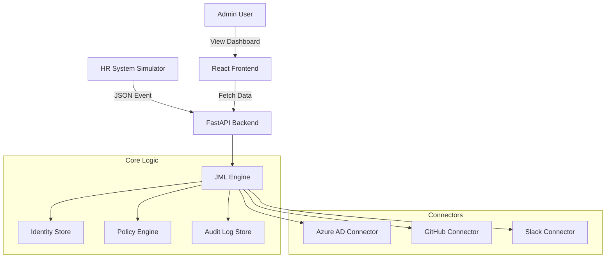

# Enterprise Identity Governance & Administration (IGA) Platform


A comprehensive, simulated **Identity Governance & Administration (IGA)** platform designed to demonstrate enterprise-grade **Joiner-Mover-Leaver (JML)** automation, policy enforcement, and audit compliance.

This project serves as a reference architecture for building modern IGA solutions using Python (FastAPI) and React.

## 🚀 Key Features

### 1. Identity Lifecycle Management (JML)
-   **Joiner**: Automated provisioning of accounts across Azure AD, GitHub, and Slack based on HR events.
-   **Mover**: Intelligent detection of department changes with automatic entitlement calculation (add new access, revoke old access).
-   **Leaver**: One-click termination that disables accounts and revokes access across all connected systems.

### 2. Policy & Compliance Engine
-   **Birthright Access**: Automatically assigns entitlements based on Department (e.g., Engineering gets GitHub, Sales gets Salesforce).
-   **Separation of Duties (SoD)**: Detects and flags toxic combinations of access (e.g., User has both "Sales" and "Finance Admin" roles).
-   **Audit Logging**: Immutable log of every identity event for compliance (ISO 27001, SOC2).

### 3. Simulated Connectors
-   **Azure AD**: User creation, group assignment, account disabling.
-   **GitHub**: User invitation, team membership management.
-   **Slack**: User creation, channel management, deactivation.
-   *Note: All connectors are simulated in-memory for safety and ease of demonstration.*

### 4. Modern Dashboard
-   **Identity Directory**: Real-time view of all identities and their current entitlements.
-   **HR Feed Simulator**: Trigger "Hire", "Move", and "Terminate" events directly from the UI.
-   **Audit Log Viewer**: Inspect system logs in real-time.

## 🏗 Architecture



## 🛠 Project Structure

```text
IGA_Platform/
├── backend/                # FastAPI Backend
│   ├── api/                # API Routes
│   ├── engines/            # Core Logic (JML, Policy)
│   ├── stores/             # In-memory Databases
│   ├── config.py           # Configuration
│   └── main.py             # Entry Point
├── connectors/             # Simulated Integrations
│   ├── azuread_connector.py
│   ├── github_connector.py
│   └── slack_connector.py
├── frontend/               # React Dashboard
│   ├── src/
│   └── package.json
├── tests/                  # Pytest Suite
├── Makefile                # Task Runner
├── pyproject.toml          # Python Config
└── README.md               # Documentation
```

## ⚡️ Quick Start

### Prerequisites
-   Python 3.9+
-   Node.js 16+

### Installation

1.  **Clone the repository**:
    ```bash
    git clone https://github.com/your-username/IGA_Platform.git
    cd IGA_Platform
    ```

2.  **Install Backend Dependencies**:
    ```bash
    make install
    ```

### Running the Platform

1.  **Start the Backend** (Terminal 1):
    ```bash
    make run-backend
    ```
    *API running at http://localhost:8000*

2.  **Start the Frontend** (Terminal 2):
    ```bash
    make run-frontend
    ```
    *Dashboard running at http://localhost:5173*

## 🧪 Lab Manual / Usage Guide

### Scenario 1: The New Hire (Joiner)
1.  Go to the **Dashboard**.
2.  In the **HR Feed Simulator**, enter:
    -   Name: **Alice Engineer**
    -   Department: **Engineering**
3.  Click **Trigger New Hire**.
4.  **Verify**:
    -   Alice appears in the directory.
    -   She has **GitHub:Engineering** and **AzureAD:Engineering** entitlements.
    -   Check the **Audit Logs** tab to see the provisioning events.

### Scenario 2: The Transfer (Mover)
1.  Find Alice in the directory.
2.  Click the **Move Dept** button.
3.  Enter **Sales** as the new department.
4.  **Verify**:
    -   Alice's department updates to Sales.
    -   **GitHub:Engineering** is REMOVED (Revocation).
    -   **AzureAD:Sales** is ADDED (Provisioning).

### Scenario 3: Access Request (Self-Service)
1.  Go to the **Access Requests** tab.
2.  **Submit a Request**:
    -   Select **Alice Engineer** as the requester.
    -   Entitlement: `GitHub:SuperAdmin`.
    -   Justification: "Need to configure repo settings".
    -   Click **Submit**.
3.  **Approve the Request**:
    -   In the "Access Requests" list, you will see the pending request.
    -   At the top right, select a different user (e.g., **Bob Manager**) to act as the Approver.
    -   Click **Approve**.
4.  **Verify**:
    -   Request status changes to **Approved**.
    -   Go to **Identity Directory** and check Alice's entitlements. `GitHub:SuperAdmin` is now present.
    -   Check **Audit Logs** for "submit_request", "approve_request", and "grant_access".

### Scenario 4: The Departure (Leaver)
1.  Click the **Terminate** button for Alice.
2.  **Verify**:
    -   Status changes to **Terminated**.
    -   All entitlements are cleared.
    -   Audit logs show "disable_account" for AzureAD, GitHub, and Slack.

## 🛡 Security & Compliance

-   **Simulated Environment**: No real data is sent to external providers.
-   **Audit Trails**: All actions are logged with timestamps and actors.
-   **SoD Checks**: The Policy Engine actively checks for toxic combinations (e.g., HR + Engineering).

## 📄 License

MIT License - see [LICENSE](LICENSE) for details.
